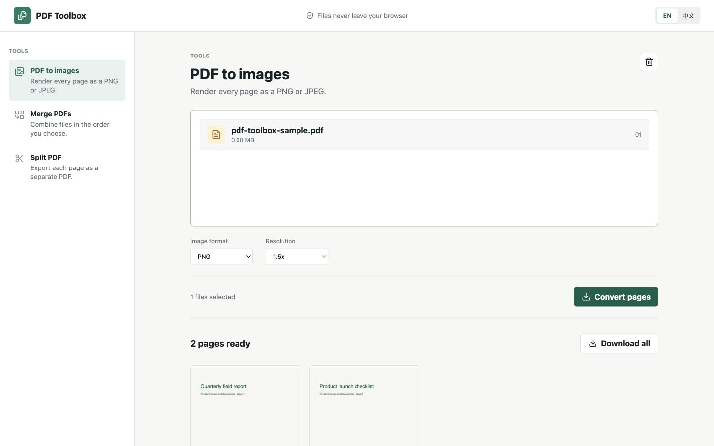

# PDF 工具箱

<!-- repo-languages:start -->
[English](README.md) | 简体中文
<!-- repo-languages:end -->

<!-- repo-badges:start -->

<!-- repo-badges:end -->

一个注重隐私、完全运行在浏览器中的 PDF 工作区。支持将 PDF 页面转换为 PNG 或 JPEG、按顺序合并多个文件，以及将文档逐页拆分。文件仅在本地处理，不会上传到服务器。

[打开 PDF 工具箱](https://shenzhepei.github.io/pdf2img/)

## 功能

- 将 PDF 的每一页转换为 PNG 或 JPEG，可选择清晰度与 JPEG 质量
- 预览转换结果，并将全部图片打包为 ZIP 下载
- 按选择顺序合并多个 PDF
- 将 PDF 逐页拆分，并以 ZIP 打包下载
- 全程在客户端处理，不上传文件
- 完整适配桌面和移动端的中英文界面

## 本地开发

需要 Node.js 24 和 pnpm 10.33.2。

    corepack enable
    pnpm install
    pnpm dev

运行生产构建与测试：

    pnpm build
    pnpm test:coverage

## 许可证

MIT。原项目 2021 年的版权声明保留在 [LICENSE](LICENSE) 中。
